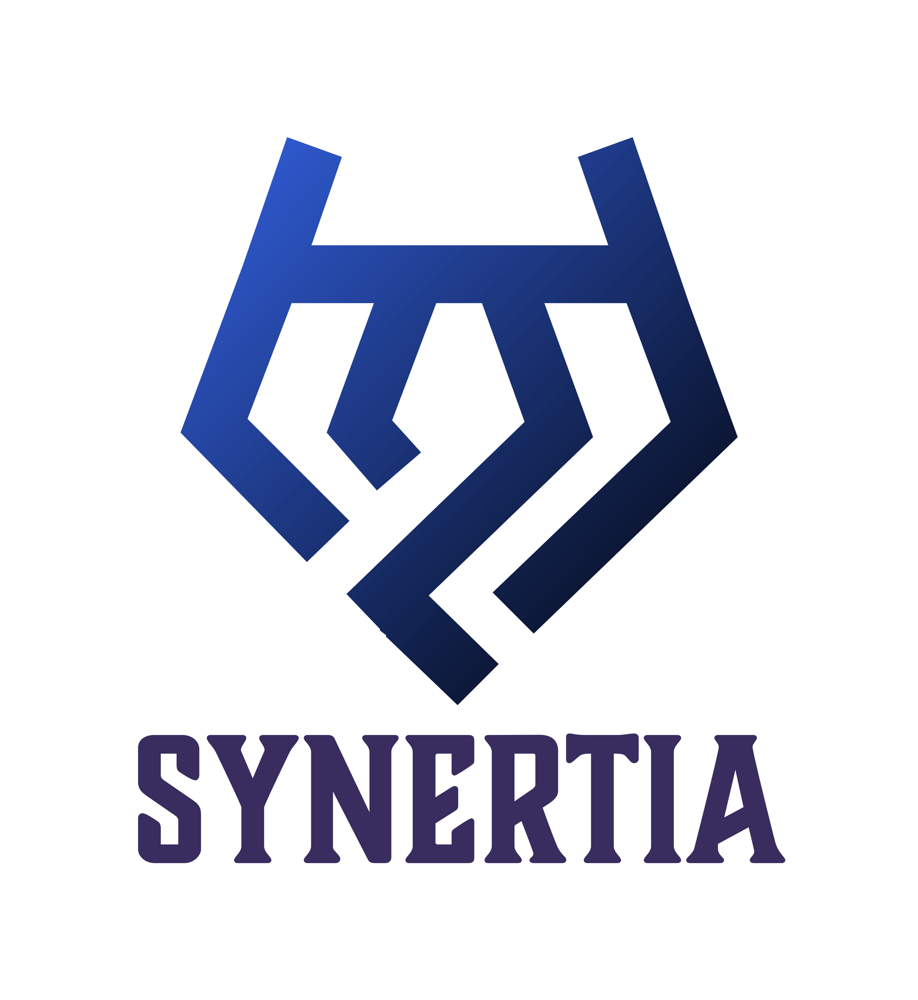

## **Design**

### ***Low-fidelity Design Link*** 

#### ***https://www.figma.com/design/rBJQNe5tjdlRif5Jf6dnM3/low-fidelity_Capstone?node-id=0-1&t=6oYonvIbeMB0nGjP-1***

### ***Low-fidelity Prototype Link*** 

#### ***https://www.figma.com/proto/rBJQNe5tjdlRif5Jf6dnM3/low-fidelity_Capstone?node-id=0-1&t=6oYonvIbeMB0nGjP-1***

### ***High-fidelity Design Link*** 

#### ***https://www.figma.com/design/rBJQNe5tjdlRif5Jf6dnM3/low-fidelity_Capstone?node-id=0-1&t=pDZmzxnYFUpj04CB-1***

### ***High-fidelity Prototype Link*** 

#### ***https://www.figma.com/proto/rBJQNe5tjdlRif5Jf6dnM3/low-fidelity_Capstone?node-id=0-1&t=pDZmzxnYFUpj04CB-1***

---

## **Deployed Link**

### ***Backend :*** https://synertia.onrender.com

### ***Frontend :*** https://synertia.netlify.app/
---

# ***SYNERTIA***
## **Dynamic Workforce Allocation System (D-WAS)**
## **Overview** 👀

>***A real-time workforce management platform that dynamically assigns tasks to employees based on availability, workload, and priority. Perfect for industries like customer service, IT support, logistics, and event management.***
---
## **Key Features** 👍

>### ***1️. Smart Task Allocation***
>* ***Assigns tasks to employees based on availability & workload.***
>* ***Real-time updates when new tasks are assigned.***

>### ***2️. Employee Availability & Skill Tracking***
>* ***Employees set availability to get tasks.***
>* ***Tasks assigned based on skills to ensure the right fit.***

>### ***3️. Real-time Task Progress Monitoring***
>* ***Managers see live updates on task completion.***
>* ***WebSockets enable instant task status changes.***

>### ***4️. Automated Shift & Overtime Management***
>* ***Schedules shifts without conflicts.***
>* ***Notifies employees when overtime is available.***

>### ***5️. Emergency Task Handling***
>* ***Redistributes work if an employee calls in sick.***
>* ***Ensures no delays in critical operations.***

>### ***6️. Performance Analytics & Dashboard***
>* ***Task completion rate, overtime stats, & employee efficiency.***
>* ***Dynamic charts & reports for workforce insights.***
---
## **Tech Stack** 🛠️

>### ***1. Frontend (React)***
>* ***React.js – Fast & interactive UI***
>* ***Tailwind CSS – Clean, modern styling***
>* ***Recharts – Real-time data visualization***

>### ***2. Backend (Node.js + Express)***
>* ***Node.js – Handles API requests***
>* ***Express.js – Fast backend framework***
>* ***MongoDB – NoSQL database for flexibility***
>* ***Mongoose – MongoDB ORM for schema management***

>### ***3. Authentication & Security***
>* ***JWT (JSON Web Tokens) – Secure authentication***
>* ***BCrypt.js – Password hashing***
>* ***Role-based Access Control (RBAC) – Manager & Employee roles***

>### ***4. Real-time Communication***
>* ***WebSockets (Socket.io) – Instant updates***

>***5. Deployment***
>* ***Frontend: Vercel / Netlify***
>* ***Backend: Render***
>* ***Database: MongoDB Atlas***
---

## **PLAN** 🗓️

### **Day 1:**
>* ***Set up MERN stack (MongoDB, Express, React, Node.js).***
>* ***Initialize project folders: backend & frontend.***
>* ***Install dependencies.***

### **Day 2:**
>* ***Implement authentication & authorization (JWT).***
>* ***Create User model (Manager & Employee roles).***

### **Day 3:**
>* ***Build Login, Register, and Role-based Access Control (RBAC).***
>* ***Build Task Management API (Create, Assign, Update, Complete tasks).***

### **Day 4:**
>* ***Develop Task UI in React (Managers assign, Employees view & update tasks).***
>* ***Test everything using Bruno / Postman & React UI.***
>* ***Fix any bugs.***

### **Day 5:**
>* ***Install Socket.io for real-time task updates.***
>* ***When a manager assigns a task, employees get live notifications.***

### **Day 6:**
>* ***Employees update task status → managers see instant progress.***
>* ***Employees set available shifts.***

### **Day 7:**
>* ***Managers see who’s available & assign shifts.***
>* ***Overtime requests appear in the dashboard.***

### **Day 8:**
>* ***Add filters (Pending, In Progress, Completed).***
>* ***Sort by deadline, priority, and assigned employee.***

### **Day 9:**
>* ***Test real-time updates (Assign a task → see instant updates).***
>* ***Check database changes (Shift scheduling & overtime).***

### **Day 10:**
>* ***Fix any UI or API issues.***
>* ***Add user authentication (login/signup).***

### **Day 11:**
>* ***Use JWT tokens for secure access.***
>* ***Encrypt passwords using bcrypt.***

### **Day 12:**
>* ***Restrict pages based on user role (Manager/Employee).***

### **Day 13:**
>* ***Employees can only see their assigned tasks.***
>* ***Managers can access all data.***

### **Day 14:**
>* ***Lazy load React components for faster loading.***
>* ***Paginate large task lists to prevent overload.***

### **Day 15:**
>* ***Optimize database queries for speed.***
>* ***Encrypt sensitive data (like passwords).***
>* ***Use HTTPS in production.***
>* ***Set up environment variables (.env) for secrets.***

### **Day 16:**
>* ***Test authentication & role-based access (Managers vs. Employees).***
>* ***Check real-time updates (Task assignments should be instant).***

### **Day 17:**
>* ***Verify task filtering, sorting & pagination.***
>* ***Fix any UI/UX inconsistencies.***

### **Day 18:**
>* ***Hosting backend on Render***

### **Day 19:**
>* ***Hosting frontend on Vercel / Netlify***

### **Day 20:**
>* ***Testing / Fixing any issue.***
>* ***Get Feedback.***

## MileStones 🎉

>### ***Milestone 1***
>***Submitted the project idea + plan***

>### ***Milestone 2***
>***Created a low-fid Design***

>### ***Milestone 3***
>***Created a High-fid Design***

>### ***Milestone 4***
>***Created a Github and Added a Readme file***

>### ***Milestone 5***
>***Manage all daily tasks and project milestone progress via github projects***

>### ***Milestone 6***
>***GET API***

>### ***Milestone 7***
>***POST API***

>### ***Milestone 8***
>***PUT API***

>### ***Milestone 9***
>***Deploy Backend***

>### ***Milestone 10***
>***Database Schema***

>### ***Milestone 11***
>***Database Read and Write***

>### ***Milestone 12***
>***Implement Relationship between entities***

>### ***Milestone 13***
>***Frontend Initialization***

>### ***Milestone 14***
>***Deploy Frontend***

>### ***Milestone 15***
>***Frontend Components***