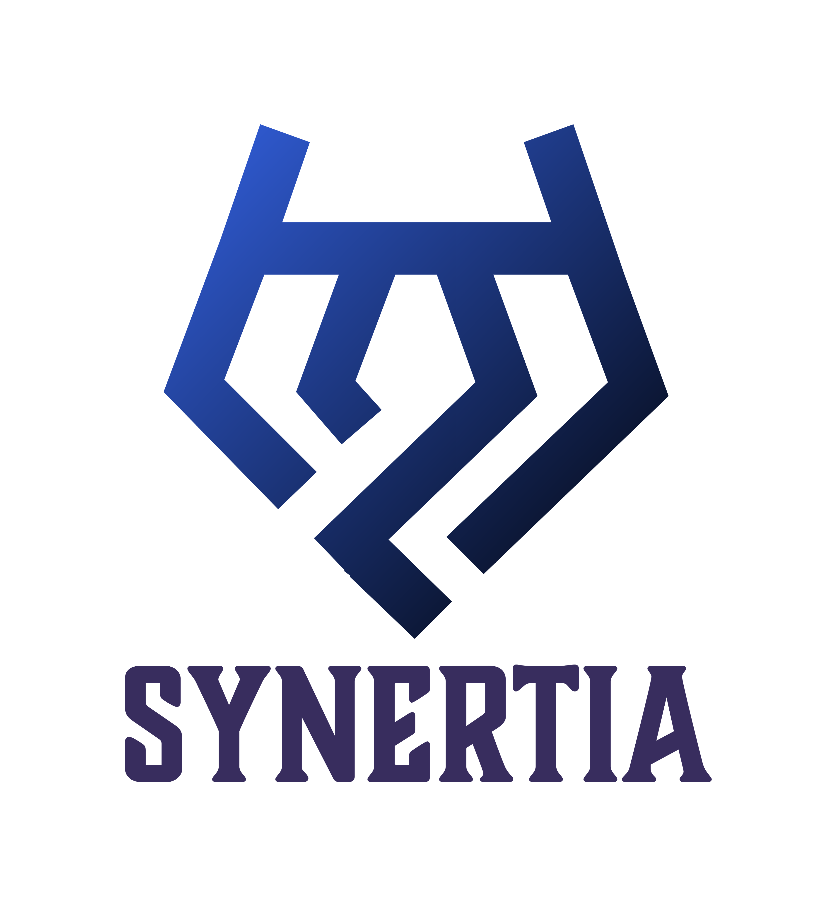

# ***SYNERTIA***
## **Dynamic Workforce Allocation System (D-WAS)**
## **Overview** 👀

>***A real-time workforce management platform that dynamically assigns tasks to employees based on availability, workload, and priority. Perfect for industries like customer service, IT support, logistics, and event management.***
---
## **Key Features** 👍

>### ***1️. Smart Task Allocation***
>* ***Assigns tasks to employees based on availability & workload.***
>* ***Real-time updates when new tasks are assigned.***

>### ***2️. Employee Availability & Skill Tracking***
>* ***Employees set availability to get tasks.***
>* ***Tasks assigned based on skills to ensure the right fit.***

>### ***3️. Real-time Task Progress Monitoring***
>* ***Managers see live updates on task completion.***
>* ***WebSockets enable instant task status changes.***

>### ***4️. Automated Shift & Overtime Management***
>* ***Schedules shifts without conflicts.***
>* ***Notifies employees when overtime is available.***

>### ***5️. Emergency Task Handling***
>* ***Redistributes work if an employee calls in sick.***
>* ***Ensures no delays in critical operations.***

>### ***6️. Performance Analytics & Dashboard***
>* ***Task completion rate, overtime stats, & employee efficiency.***
>* ***Dynamic charts & reports for workforce insights.***
---
## **Tech Stack** 🛠️

>### ***1. Frontend (React)***
>* ***React.js – Fast & interactive UI***
>* ***Tailwind CSS – Clean, modern styling***
>* ***Recharts – Real-time data visualization***

>### ***2. Backend (Node.js + Express)***
>* ***Node.js – Handles API requests***
>* ***Express.js – Fast backend framework***
>* ***MongoDB – NoSQL database for flexibility***
>* ***Mongoose – MongoDB ORM for schema management***

>### ***3. Authentication & Security***
>* ***JWT (JSON Web Tokens) – Secure authentication***
>* ***BCrypt.js – Password hashing***
>* ***Role-based Access Control (RBAC) – Manager & Employee roles***

>### ***4. Real-time Communication***
>* ***WebSockets (Socket.io) – Instant updates***

>***5. Deployment***
>* ***Frontend: Vercel / Netlify***
>* ***Backend: Render***
>* ***Database: MongoDB Atlas***
---

## MileStones 🎉

>### ***Milestone 1***
>***Submitted the project idea + plan***

>### ***Milestone 2***
>***Created a low-fid Design***

>### ***Milestone 3***
>***Created a High-fid Design***

>### ***Milestone 4***
>***Created a Github and Added a Readme file***

>### ***Milestone 5***
>***Manage all daily tasks and project milestone progress via github projects***